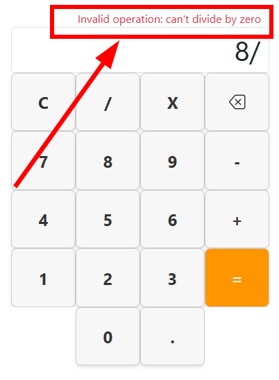
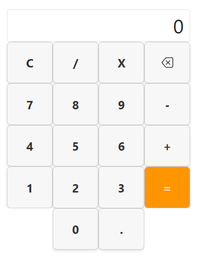

# Simple Calculator App
This little calculator app is built using .NET Core 8 with an MVC (Mode-View-Controller) architecture. I've used a fair amount of Javascript for the functionality and calculations as well.  
 
### Technologies

## Table of Contents
- [Description](#description)
- [Getting Started](#getting-started)
- [Usage](#usage)
- [Credits](#credits)

## Description
This mobile responsive app calculator allows you to perform all the usual calculations and includes user error/warning messages for invalid operations such as dividing by zero (see screenshot below). I've used a lot of Javascript for the functionality of the buttons and the calculations to ensure everything is nice and responsive. It handles decimal calculations and I've done fairly thorough testing, although I will be revisiting the code every now and again to add functionality or fix bugs that I find. 

## Getting Started
This project is a .NET Core MVC web application. To run it outside of Visual Studio, you'll need the **.NET Core SDK** installed on your machine (the version that is compatible with this project - 8.0). 

1. **Get the code (cloning the repository)** - You'll first need to get the code from Github. Follow these steps from your command line interface (CLI), such as Command Prompt, Powershell or Bash: 
`git clone https://github.com/evanmalherbe/Calculator.git`
2. **Navigate to project directory** - Now use the `cd` command to move into the directory that contains the project's `.csproj` file. 
`cd Calculator`
3. **Restore dependencies (optional but recommended):** Run the following command to download any necessary packages and dependencies. This is often done automatically, but this makes sure everything is in place. 
`dotnet restore`
4. **Run the application:** Execute the project using the `dotnet run` command.  `dotnet run`
5. **Access the application:** Once the application starts, the console output will show the urls where the app is listening. Usually, it will be something like `http://localhost:5000` or `http://localhost:5001`. Open your web browser (E.g. Microsoft Edge, Google Chrome etc) and type that address into your browser address bar to use the calculator.

## Usage
Once you open the project in your browser `http://localhost:5000` (or similar), you will see the calculator with it's familiar layout of buttons. Simply use the number keypad on your keyboard or use your mouse to click the buttons on screen. See figure 1 below. 

## Credits
This project was created by Evan Malherbe - October 2025 - [GitHub profile](https://github.com/evanmalherbe)
